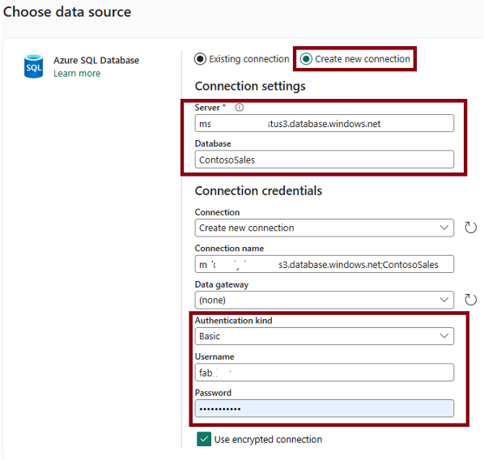
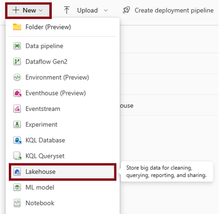
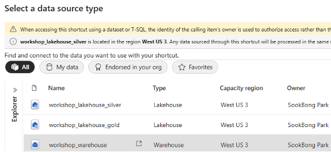
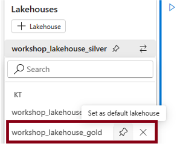
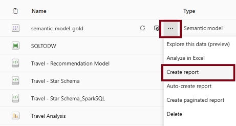

# Workspace, Warehouse 생성

이 문서는 Microsoft Fabric에서 Workspace와 Warehouse를 생성하는 사전 단계에 대해 설명합니다. 아래 단계에 따라 실습을 진행하세요.

## 1. Workspace 생성


- **Synapse Data Engineering** 메뉴에서 좌측 하단의 `+ New workspace` 버튼을 클릭하여 새로운 Workspace를 생성합니다.

## 2. Workspace 설정


- Workspace를 생성한 후, `Workspace settings`에서 Spark 환경을 설정할 수 있습니다.
- `Spark settings` 메뉴에서 `Environment` 탭을 선택합니다.
- `Runtime Version`에서 원하는 Spark 버전을 선택합니다.
  - 예시: `1.3 Experimental (Spark 3.5, Delta 3 OSS)` 등

## 3. Data Warehouse 생성


- Workspace 내에서 상단의 `+ New` 버튼을 클릭합니다.
- 드롭다운 메뉴에서 `Warehouse`를 선택하여 Warehouse를 생성할 수 있습니다.
- 생성된 Warehouse는 Workspace 내에서 확인할 수 있습니다.

## 4. SAS 키를 사용한 데이터 복사

- **LabFiles**: `LabFiles\Data-Warehouse`
- **대상**:
  - Warehouse
  - 테이블: `dbo.answers`
- **소스**:
  - Azure DataLake Gen2
  - 테이블: `dbo.answers`

### SQL 쿼리 예제


```sql
--CREATE TABLE
dbo.answers (
    questionId bigint NULL,
    question varchar(500) NULL,
    connectionId varchar(100) NULL,
    userAgent varchar(100) NULL,
    answerId int NULL,
    answer varchar(2000) NULL,
    responseTime smallint NULL,
    createdAt date NULL
)
GO

--DATA COPY
COPY INTO dbo.answers
```
결과: 3,000,000개의 행이 성공적으로 복사되었습니다.

## 5. Data Pipeline을 활용한 데이터 적재

### 대상
- **Warehouse**
- **테이블**: dbo.sales_transactions

### 소스
- **Azure SQL Database**
- **테이블**: dbo.sales_transactions

1. **New Data Pipeline 생성**
   - Workspace로 이동하여 "New data pipeline"을 선택합니다.
   

2. **연결 설정**
   - "Create new connection"을 선택하고 서버 이름, 데이터베이스 이름, 인증 정보를 입력합니다.
   

3. **데이터 소스 연결**
   - 테이블을 선택하고 데이터를 미리 봅니다.
   

4. **데이터 대상 연결**
   - 새 테이블로 로드하고 열 매핑을 설정합니다.
   

5. **Pipeline 실행 ID 확인**
   - 실행 ID와 활동 상태를 확인합니다.
   

### 결과
- `dbo.sales_transactions` 테이블이 Warehouse에 성공적으로 생성되었습니다.


## 6. Lakehouse OneLake shourtcut 생성

### 단계
1. **Lakehouse 생성**
   - `workshop_lakehouse_silver` 및 `workshop_lakehouse_gold` 생성
   

2. **Add OneLake shortcut**
   - **대상**:
     - `workshop_warehouse`
     - 테이블: `dbo.answers`, `dbo.sales_transactions`
   - **소스**:
     - `workshop_lakehouse_silver`
     - 테이블: `dbo.sales_transactions`
   

3. **데이터 소스 유형 선택**
   - 데이터셋 또는 T-SQL을 사용하여 이 바로 가기에 액세스할 때 호출 항목 소유자의 ID가 사용되어 액세스 권한이 부여됩니다.
   

4. **OneLake shortcut 확인**
   - `workshop_warehouse`에 바로 가기가 성공적으로 생성되었는지 확인합니다.

      

## 7. S3 Shortcut 생성

### 단계
1. **Amazon S3 Shortcut**
   - **LabFiles**: `LabFiles\Connection_info.txt`
   - **대상**:
     - `workshop_lakehouse_silver`
     - 파일: `fabricsparkstore`
   - **소스**:
     - `fabricsparkstore`
     - 파일 이름: `marketing_campaign.csv`
   

2. **연결 설정**
   - 새 연결을 생성합니다.
   - 연결 이름: `s3_marketing`
   - 인증 종류: Access Key
     - Access Key ID: `********`
     - Secret Access Key: `********`
   

3. **OneLake shortcut 확인**
   - 폴더와 테이블을 검토한 후 바로 가기를 생성합니다.
   - `workshop_lakehouse_silver`에 바로 가기가 성공적으로 생성되었는지 확인합니다.
   

## 8. 파일 업로드

### 단계
1. **S3 바로 가기**
   - **LabFiles**: `LabFiles\Data-Engineering\features.csv`
   - **대상**:
     - `workshop_lakehouse_silver`
     - 파일: `features.csv` (옵션: 폴더 생성)
   

2. **업로드 확인**
   - `features.csv` 파일이 `workshop_lakehouse_silver`에 성공적으로 업로드되었는지 확인합니다.
   

## 9. 데이터 마트 생성 (Gold Data)

### 단계
1. **Notebook**
   - **LabFiles**: `LabFiles\Data-Engineering\Travel - Star Schema_SparkSQL.ipynb`
   - Notebook을 Workspace에 Import 합니다.
   

2. **Lakehouse 추가**
   - Notebook에 `workshop_lakehouse_silver` 및 `workshop_lakehouse_gold` 추가
   

3. **테이블 확인**
   - `workshop_lakehouse_gold`의 테이블 확인:
     - `dim_customer`
     - `dim_dates`
     - `dim_promotions`
     - `dim_purchase`
     - `dim_supplier`
     - `fact_sale`

4. **SparkSQL 실행**
   - SparkSQL 쿼리를 실행하여 데이터 마트의 테이블을 채웁니다.

## 10. Semantic 모델 생성

### 단계
1. **새 Semantic Model**
   - `workshop_lakehouse_gold`로 이동합니다.
   - "New semantic model"을 선택합니다.
   - 모델 이름: `semantic_model_gold` 입력
   - 관련 테이블 선택:
     - `dim_promotions`
     - `dim_supplier`
     - `dim_customer`
     - `fact_sale`
     - `dim_purchase`
     - `dim_dates`
   

2. **Semantic model 열기**
   - Workspace로 이동하여 `semantic_model_gold` 선택
   - "Open data model" 클릭
   

3. **관계 설정**
   - Semantic Model의 테이블 간 관계 정의
   - 

4. **Semantic Model 확인**
   - Semantic Model이 성공적으로 생성되고 관계가 설정되었는지 확인
   

## 11. Power BI Report

### 단계
   
1. **Semantic Model 및 Power BI Copilot Report 생성**
   -Workspace로 이동하여 Semantic Model `semantic_model_gold` 선택
   - `...` 메뉴를 클릭하고 "Create report" 선택
   

2. **데이터 탐색 및 Copilot을 사용한 보고서 생성**
   - Copilot을 사용하여 데이터 분석 및 탐색
   - 다음과 같은 인사이트 페이지 생성:
      - 고객 행동 인사이트
      - 공급자 서비스 평가
      - 프로모션 효과 추적
   

3. **Power BI Desktop**
   - Power BI Desktop에서 보고서를 열어 추가 사용자 지정 및 시각화
   

### 결과
- 고객 행동, 공급자 성과 및 프로모션 효과에 대한 인사이트가 포함된 여행 분석 보고서가 성공적으로 생성되었습니다.