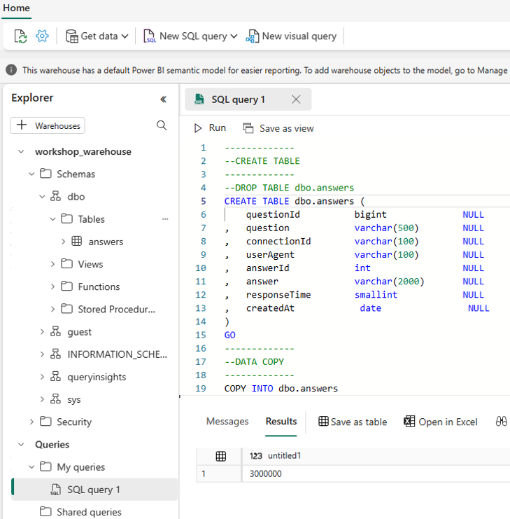
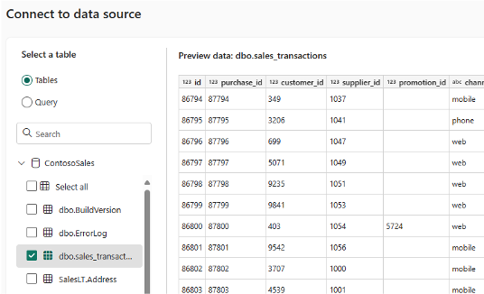
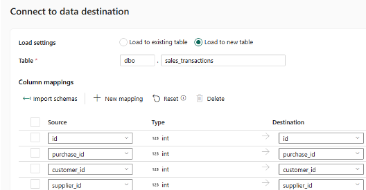
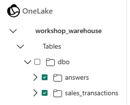
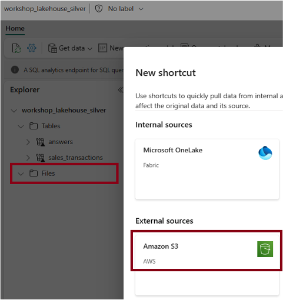
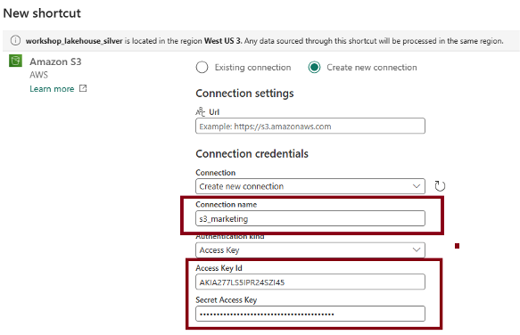
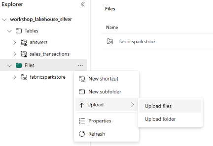
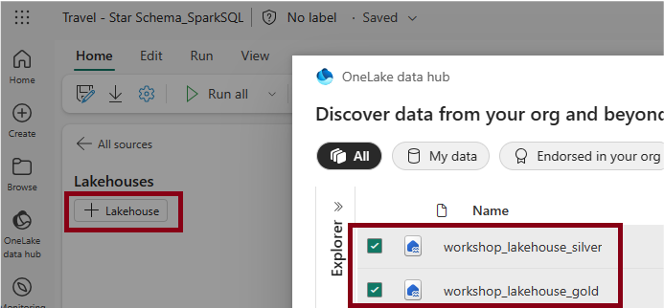
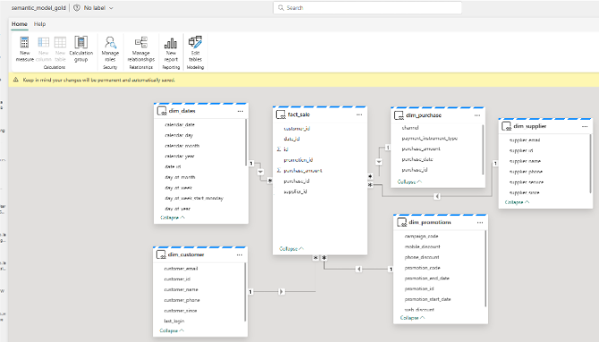
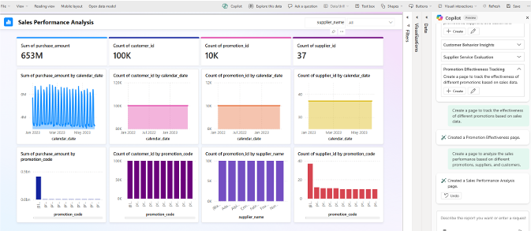

# Pre – Create Workspace, Warehouse

이 문서는 Microsoft Fabric에서 워크스페이스와 웨어하우스를 생성하는 사전 단계에 대해 설명합니다.

## 1. Create Workspace


- **Synapse Data Engineering** 메뉴에서 좌측 하단의 `+ New workspace` 버튼을 클릭하여 새로운 워크스페이스를 생성합니다.

## 2. Workspace Settings


- 워크스페이스를 생성한 후, `Workspace settings`에서 Spark 환경을 설정할 수 있습니다.
- `Spark settings` 메뉴에서 `Environment` 탭을 선택합니다.
- `Runtime Version`에서 원하는 Spark 버전을 선택할 수 있습니다.
  - 예시: `1.3 Experimental (Spark 3.5, Delta 3 OSS)` 등

## 3. Create Data Warehouse


- 워크스페이스 내에서 상단의 `+ New` 버튼을 클릭합니다.
- 드롭다운 메뉴에서 `Warehouse`를 선택하여 웨어하우스를 생성할 수 있습니다.
- 생성된 웨어하우스는 워크스페이스 내에서 확인할 수 있습니다.

## 4. Copy Data with SAS Key

- **LabFiles**: `LabFiles\Data-Warehouse`
- **Target**:
  - Warehouse
  - Tables: `dbo.answers`
- **Source**:
  - Azure DataLake Gen2
  - Tables: `dbo.answers`

### SQL Query Example



```sql
--CREATE TABLE
dbo.answers (
    questionId bigint NULL,
    question varchar(500) NULL,
    connectionId varchar(100) NULL,
    userAgent varchar(100) NULL,
    answerId int NULL,
    answer varchar(2000) NULL,
    responseTime smallint NULL,
    createdAt date NULL
)
GO

--DATA COPY
COPY INTO dbo.answers
```
결과: 3,000,000 rows가 성공적으로 복사되었습니다.

## 5. Ingest Data with Pipeline

### Target
- **Warehouse**
- **Tables**: dbo.sales_transactions

### Source
- **Azure SQL Database**
- **Tables**: dbo.sales_transactions

1. **Create a new data pipeline**
   - Navigate to the workspace and select "New data pipeline".
   - 

2. **Connection settings**
   - Choose "Create new connection".
   - Enter the server name: `ms.tus3.database.windows.net`.
   - Enter the database name: `ContosoSales`.
   - Provide authentication credentials:
     - Authentication kind: Basic
     - Username: `fabricuser01`
     - Password: `********`
   - Use encrypted connection.
   - 

3. **Connect to data source**
   - Select the table: `dbo.sales_transactions`.
   - Preview the data.
   - 

4. **Connect to data destination**
   - Load settings:
     - Load to new table: `dbo.sales_transactions`.
   - Column mappings:
     - Map source columns to destination columns.
   - 

5. **Pipeline run ID**
   - Verify the pipeline run ID: `69e8034b-9d1a-43be-adf2-62fbecd009e6`.
   - Check the activity status: `Succeeded`.
   - 

### Result
- The table `dbo.sales_transactions` is successfully created in the warehouse.
- 

## 6. Create Lakehouse and Shortcut from Warehouse

### Steps
1. **Create Lakehouse**
   - Create `workshop_lakehouse_silver` and `workshop_lakehouse_gold`.
   - 

2. **Add Table Shortcut**
   - **Target**:
     - `workshop_warehouse`
     - Tables: `dbo.answers`, `dbo.sales_transactions`
   - **Source**:
     - `workshop_lakehouse_silver`
     - Tables: `dbo.sales_transactions`
   - 

3. **Select Data Source Type**
   - When accessing this shortcut using a dataset or T-SQL, the identity of the calling item's owner is used to authorize access.
   - 

4. **Verify Shortcut**
   - Confirm the shortcut is created successfully in `workshop_warehouse`.
   - 

## 7.  Shortcut from S3

### Steps
1. **S3 Shortcut**
   - **LabFiles**: `LabFiles\Connection_info.txt`
   - **Target**:
     - `workshop_lakehouse_silver`
     - Files: `fabricsparkstore`
   - **Source**:
     - `fabricsparkstore`
     - Filename: `marketing_campaign.csv`
   - 

2. **Connection Settings**
   - Create a new connection.
   - Connection name: `s3_marketing`
   - Authentication kind: Access Key
     - Access Key ID: `AKIAZ77LS5PR24SZ45`
     - Secret Access Key: `********`
   - 

3. **Verify Shortcut**
   - Review the folders and tables, then create the shortcut.
   - Confirm the shortcut is created successfully in `workshop_lakehouse_silver`.
   - 

## 8. Upload File

### Steps
1. **S3 Shortcut**
   - **LabFiles**: `LabFiles\Data-Engineering\features.csv`
   - **Target**:
     - `workshop_lakehouse_silver`
     - Files: `features.csv` (Option: Folder Create)
   - 

2. **Verify Upload**
   - Confirm the file `features.csv` is successfully uploaded to `workshop_lakehouse_silver`.
   - 

## 9.  Create Data Mart (Gold Data)

### Steps
1. **Notebook**
   - **LabFiles**: `LabFiles\Data-Engineering\Travel - Star Schema_SparkSQL.ipynb`
   - Import the notebook into the workspace.
   - 

2. **Add Lakehouse**
   - Add `workshop_lakehouse_silver` and `workshop_lakehouse_gold` to the notebook.
   - 

3. **Verify Tables**
   - Confirm the tables in `workshop_lakehouse_gold`:
     - `dim_customer`
     - `dim_dates`
     - `dim_promotions`
     - `dim_purchase`
     - `dim_supplier`
     - `fact_sale`

4. **Run SparkSQL**
   - Execute SparkSQL queries to populate the tables in the data mart.

## 10. Create Semantic Model

### Steps
1. **New Semantic Model**
   - Navigate to `workshop_lakehouse_gold`.
   - Select "New semantic model".
   - Name the model: `semantic_model_gold`.
   - Select all relevant tables:
     - `dim_promotions`
     - `dim_supplier`
     - `dim_customer`
     - `fact_sale`
     - `dim_purchase`
     - `dim_dates`
   - 

2. **Open Data Model**
   - Navigate to the workspace and select `semantic_model_gold`.
   - Click "Open data model".
   - 

3. **Set Relationships**
   - Define relationships between tables in the semantic model.
   - 

4. **Verify Semantic Model**
   - Confirm the semantic model is successfully created and relationships are set.
   - 

   ## 11. Self Business Intelligence
   
   ### Steps
   
   1. **Semantic Model and Auto Create Report**
      - Navigate to the workspace and select the semantic model `semantic_model_gold`.
      - Click on the `...` menu and choose "Create report".
      - 
   
   2. **Explore Data and Create Report with Copilot**
      - Use Copilot to analyze and explore the data.
      - Create pages for insights such as:
        - Customer Behavior Insights
        - Supplier Service Evaluation
        - Promotion Effectiveness Tracking
      - 
   
   3. **Power BI Desktop**
      - Open the report in Power BI Desktop for further customization and visualization.
      - 
   
   ### Result
   - Successfully created a Travel Analysis Report with insights into customer behavior, supplier performance, and promotion effectiveness.