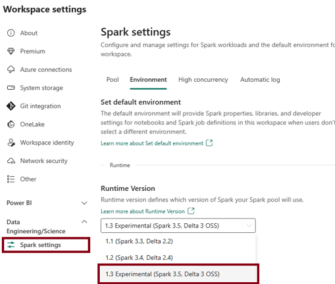

# Pre – Create Workspace, Warehouse

이 문서는 Microsoft Fabric에서 워크스페이스와 웨어하우스를 생성하는 사전 단계에 대해 설명합니다.

## 1. 워크스페이스 생성


- **Synapse Data Engineering** 메뉴에서 좌측 하단의 `+ New workspace` 버튼을 클릭하여 새로운 워크스페이스를 생성합니다.

## 2. 워크스페이스 설정



- 워크스페이스를 생성한 후, `Workspace settings`에서 Spark 환경을 설정할 수 있습니다.
- `Spark settings` 메뉴에서 `Environment` 탭을 선택합니다.
- `Runtime Version`에서 원하는 Spark 버전을 선택할 수 있습니다.
  - 예시: `1.3 Experimental (Spark 3.5, Delta 3 OSS)` 등

## 3. 웨어하우스 생성


- 워크스페이스 내에서 상단의 `+ New` 버튼을 클릭합니다.
- 드롭다운 메뉴에서 `Warehouse`를 선택하여 웨어하우스를 생성할 수 있습니다.
- 생성된 웨어하우스는 워크스페이스 내에서 확인할 수 있습니다.

## 4. Copy Data with SAS Key

- **LabFiles**: `LabFiles\Data-Warehouse`
- **Target**:
  - Warehouse
  - Tables: `dbo.answers`
- **Source**:
  - Azure DataLake Gen2
  - Tables: `dbo.answers`

### SQL Query Example


```sql
--CREATE TABLE
dbo.answers (
    questionId bigint NULL,
    question varchar(500) NULL,
    connectionId varchar(100) NULL,
    userAgent varchar(100) NULL,
    answerId int NULL,
    answer varchar(2000) NULL,
    responseTime smallint NULL,
    createdAt date NULL
)
GO

--DATA COPY
COPY INTO dbo.answers
```
결과: 3,000,000 rows가 성공적으로 복사되었습니다.